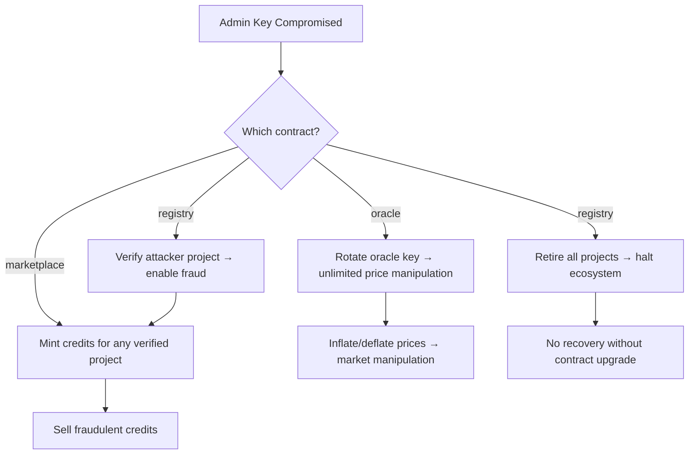

# Admin Key Compromise: Blast-Radius Analysis

**System:** StellarKraal Carbon Credit Contracts  
**Issue:** #56 — Authorization Model Audit: Admin Key Compromise and Privilege Escalation Paths  
**Date:** 2026-07-17  
**Auditor:** Kiro AI  
**Classification:** Security Analysis Document

---

## 1. Executive Summary

A compromise of any single admin key across the four StellarKraal carbon credit contracts grants an attacker significant power over the carbon credit economy. The blast radius depends on which contract's admin is compromised:

| Compromised Key | Blast Radius | Max Financial Impact | Reversibility |
|----------------|--------------|---------------------|---------------|
| `carbon_registry` admin | All project lifecycles | Credit issuance halted / all projects retired | Partially irreversible |
| `carbon_marketplace` admin | Credit minting + market operations | Unlimited credit inflation | Reversible (upgrade) |
| `carbon_oracle` admin | Price data integrity | Arbitrary price manipulation | Reversible (rotate key back) |
| `carbon_credit` admin | None (unused in current code) | None | N/A |

**Highest-risk scenario:** Compromise of the `carbon_oracle` admin, which enables silent, undetected price manipulation affecting all downstream credit valuations. This is rated **CRITICAL** because it is silent, difficult to detect on-chain, and has unbounded financial impact.

**Second-highest risk:** Compromise of the `carbon_registry` admin, which can permanently retire all projects and halt the entire carbon credit ecosystem.

---

## 2. Threat Model

### 2.1 Attacker Profile

| Scenario | Attacker Capabilities |
|----------|----------------------|
| **External attacker** | Has compromised the admin private key (e.g., via phishing, infrastructure breach, or leaked secret) |
| **Malicious insider** | Legitimate admin credential holder acting in bad faith |
| **Supply-chain attack** | Admin key extracted from a CI/CD system or deployment script |
| **Protocol attack** | Admin key extracted via a Soroban-level vulnerability (separate threat model) |

### 2.2 Attacker Goals

1. **Financial extraction** — inflate credit supply, sell into market, then collapse supply
2. **Disruption** — retire all projects, halt all trading
3. **Stealth** — manipulate oracle prices to slowly drain collateral without triggering alerts
4. **Censorship** — selectively suspend specific project owners
5. **Backdoor installation** — rotate oracle key to attacker-controlled key for persistent price control

---

## 3. carbon_registry Admin Compromise

### 3.1 Capabilities Gained

| Action | Function | Impact | Reversible |
|--------|----------|--------|-----------|
| Mark any Pending project as Verified | `verify_project` | Enables credit issuance for unverified projects | Yes — admin can suspend |
| Suspend any Verified project | `suspend_project` | Halts all trading and minting for targeted projects | Yes — admin can re-verify |
| Retire any project permanently | `retire_project` | **Irreversible.** All credits become untradeable (Retired status) | **No** |
| Cannot directly issue credits | `issue_credits` | Registry only accepts marketplace auth for this | N/A |

### 3.2 Attack Sequence: Total Ecosystem Destruction

```
1. Attacker compromises carbon_registry admin key
2. Attacker calls retire_project(id) for every active project
   → Each project transitions to status = Retired (permanent)
   → All active listings become unsettleable (purchase_listing reverts with ProjectNotVerified)
   → All future mint_project_credits calls revert
3. All carbon credits become frozen — they exist in balances but cannot be traded
4. Carbon credit market halts permanently unless contracts are upgraded
```

**Time to execute:** Single ledger per project. All projects can be retired in one Stellar transaction set with multiple operations.

**Detection:** On-chain events are visible but there is no alerting system in the current contracts.

**Recovery:** Requires admin (if recovered) to call `verify_project` on each retired project — but since `retire_project` sets `status = Retired` with no reverse function, recovery is impossible without a contract upgrade.

### 3.3 Attack Sequence: Selective Fraud

```
1. Attacker compromises carbon_registry admin key
2. Attacker calls verify_project(attacker_project_id) for an unverified project they own
   → Project transitions to Verified without legitimate verification
3. Attacker calls marketplace.mint_project_credits(attacker_project_id, MAX_AMOUNT)
   → Registry.issue_credits succeeds (attacker project is "verified")
   → Attacker's credit balance grows
4. Attacker sells credits on marketplace at market rate → financial gain
```

**Pre-condition:** Attacker must own a registered project (anyone can register).  
**Financial impact:** Limited by `total_credits` set at registration time, but attacker can set this to a large value.

### 3.4 Severity Classification

| Attack | Severity | CVSS-like Score | Mitigation |
|--------|----------|-----------------|------------|
| Mass project retirement | **CRITICAL** | 9.1 (AV:N/AC:L/PR:H/UI:N/S:C/C:H/I:H/A:H) | Timelock on `retire_project` |
| Selective fraudulent verification | **HIGH** | 8.1 (AV:N/AC:L/PR:H/UI:N/S:C/C:H/I:H/A:N) | Multi-sig on `verify_project` |
| Targeted suspension (censorship) | **MEDIUM** | 6.5 (AV:N/AC:L/PR:H/UI:N/S:C/C:N/I:H/A:H) | Timelock on `suspend_project` |

---

## 4. carbon_marketplace Admin Compromise

### 4.1 Capabilities Gained

| Action | Function | Impact | Reversible |
|--------|----------|--------|-----------|
| Mint unlimited credits for any verified project | `mint_project_credits` | Credit inflation, market manipulation | Yes — total_credits cap enforced by registry |
| (No pause function exists) | — | Cannot halt trading | N/A |

### 4.2 Attack Sequence: Credit Inflation

```
1. Attacker compromises carbon_marketplace admin key
2. Attacker calls mint_project_credits(target_project_id, large_amount) repeatedly
   → Registry.issue_credits records issuance (limited by total_credits in registry)
   → credit.mint mints tokens to project owner
3. If attacker also controls the project owner address:
   → Creates listings for inflated credits
   → Sells to unsuspecting buyers
   → Collects payment, buyers receive diluted/fraudulent credits
```

**Constraint:** `total_credits` in the registry caps the total issuable amount per project. The attacker cannot exceed this hard cap without also compromising the registry admin. This creates a meaningful containment boundary.

**If both registry AND marketplace admins are compromised:**
```
1. Registry admin calls verify_project(attacker_project_id)
2. Marketplace admin calls mint_project_credits(attacker_project_id, MAX_INT128)
   → Registry.issue_credits fails if amount > total_credits
   → But attacker set total_credits = MAX_INT128 at registration time
3. Unlimited credits minted to attacker's address
4. Marketplace flooded with fraudulent credits
```

### 4.3 Missing Capability: No Pause

A significant gap is that the marketplace admin **cannot** pause the marketplace. This means:
- A legitimate admin cannot respond to a security incident by halting trading
- An attacker with the admin key gains no ability to disrupt trading (positive)
- But the system lacks a circuit breaker (negative)

### 4.4 Severity Classification

| Attack | Severity | CVSS-like Score | Mitigation |
|--------|----------|-----------------|------------|
| Mint to attacker project (single key) | **HIGH** | 7.2 (AV:N/AC:L/PR:H/UI:N/S:C/C:H/I:H/A:N) | Timelock on `mint_project_credits` |
| Mint to any project (if owner colluding) | **HIGH** | 7.2 | Timelock + multi-sig |
| Combined registry+marketplace compromise | **CRITICAL** | 9.8 | Timelock on both; separate key custodians |

---

## 5. carbon_oracle Admin Compromise

### 5.1 Capabilities Gained

| Action | Function | Impact | Reversible |
|--------|----------|--------|-----------|
| Rotate oracle public key to attacker-controlled key | `rotate_key` | **All future price submissions controlled by attacker** | Yes — legitimate admin can rotate back, but only if they regain key access |
| Change challenge window duration | `set_challenge_window` | Shorten window to near-zero to suppress price challenges | Yes |

### 5.2 Attack Sequence: Silent Price Oracle Takeover (CRITICAL)

This is the **highest-risk scenario** in the entire system.

```
1. Attacker compromises carbon_oracle admin key
2. Attacker calls rotate_key(attacker_ed25519_pubkey)
   → Config.oracle_pubkey is immediately replaced
   → Takes effect in the same ledger as the rotate_key call
3. All subsequent submit_price calls from the legitimate oracle operator FAIL
   (their signatures are verified against the old key, which is now invalid)
4. Attacker begins submitting prices signed with attacker_ed25519_pubkey
   → All prices accepted as valid by the oracle contract
5. Attacker can now:
   a. Inflate carbon credit prices → makes worthless credits appear valuable
   b. Deflate prices → trigger forced liquidations or margin calls
   c. Submit prices for non-existent feeds → create phantom carbon project valuations
   d. Submit backdated timestamps → inject stale prices that appear fresh
6. All downstream consumers of oracle prices (marketplace, external integrators)
   receive manipulated data
7. Attacker creates listings, manipulates prices upward, sells, then collapses price
```

**Why this is rated CRITICAL above registry compromise:**
- Silent: legitimate oracle operator cannot detect the key rotation immediately
- Rapid: takes effect in one ledger (~5 seconds)
- Unbounded: no `total_credits` cap constrains price manipulation
- Compounding: price manipulation affects ALL active listings simultaneously
- Persistent: the legitimate oracle operator's submissions are silently rejected with no user-facing error to the buyer/seller

### 5.3 Attack Sequence: Challenge Window Manipulation

```
1. Attacker compromises carbon_oracle admin key
2. Attacker calls set_challenge_window(attacker_admin, 0)
   → Challenge window is set to 0 ledgers
3. All committed prices can be immediately revealed with no challenge window
4. Price manipulation via commit-reveal is no longer protected
```

**Impact:** Removes the time-based fraud detection mechanism from the commit-reveal scheme.

### 5.4 Severity Classification

| Attack | Severity | CVSS-like Score | Mitigation |
|--------|----------|-----------------|------------|
| rotate_key oracle takeover | **CRITICAL** | 9.8 (AV:N/AC:L/PR:H/UI:N/S:C/C:H/I:H/A:H) | **Timelock (24h) on `rotate_key`** |
| set_challenge_window to 0 | **HIGH** | 7.7 (AV:N/AC:L/PR:H/UI:N/S:C/C:N/I:H/A:H) | Minimum floor in contract logic |
| Price manipulation after key rotation | **CRITICAL** | 9.8 | Timelock on `rotate_key` |

---

## 6. carbon_credit Admin Compromise

The `carbon_credit` admin address is stored in `CreditConfig.admin` but is **not used in any write operation** in the current contract. No function requires `cfg.admin.require_auth()`.

**Blast radius of carbon_credit admin compromise:** Zero.

This is a positive security property — the credit ledger is controlled entirely through the marketplace, and the admin key has no direct access to mint, burn, or modify balances. The admin field is likely reserved for future upgrade governance.

**Severity:** N/A (no capability granted)

---

## 7. Combined Key Compromise Scenarios

### 7.1 Registry + Marketplace Admin (Same Key or Both Compromised)

**Probability:** Low (should be different keys/custodians)  
**Blast radius:**

```
Attack:
1. Registry admin: verify_project(attacker_project_id)
   → Total_credits set to MAX at registration
2. Marketplace admin: mint_project_credits(attacker_project_id, MAX_CREDITS)
   → Unlimited credits minted to attacker
3. Attacker floods marketplace with fraudulent credits at below-market prices
4. Attacker exits market before price collapses
```

**Severity:** CRITICAL — unbounded credit creation and market manipulation

### 7.2 Oracle + Registry Admin (Same Key or Both Compromised)

```
Attack:
1. Oracle admin: rotate_key(attacker_pubkey)
   → Attacker controls all price data
2. Registry admin: verify_project(attacker_project_id)
   → Fraudulent project appears verified
3. Attacker mints credits for fraudulent project at inflated price
4. Ecosystem perceives high-value credits backed by manipulated oracle data
```

**Severity:** CRITICAL — fraudulent credits with false price data

### 7.3 Recommended Key Separation

| Admin | Recommended Custodian | Key Type |
|-------|-----------------------|----------|
| `carbon_registry` admin | Governance multi-sig (3/5) | Hardware wallet + multi-party |
| `carbon_marketplace` admin | Ops team multi-sig (2/3) | Hardware wallet |
| `carbon_oracle` admin | Infrastructure team (separate from ops) | HSM (Hardware Security Module) |
| `carbon_credit` admin | Same as registry (currently unused) | Same multi-sig as registry |

---

## 8. Privilege Escalation Paths

### 8.1 Direct Paths



### 8.2 Indirect Paths

| Path | Steps | Net Effect |
|------|-------|-----------|
| Registry admin → inflate credit supply | verify_project(attacker) → mint_project_credits | Credits minted for unverified project |
| Oracle admin → drain collateral | rotate_key → submit low prices | Collateral values drop, forced liquidations |
| Registry admin → mass disruption | retire_project × N | All projects permanently retired |
| Oracle admin → suppress detection | set_challenge_window(0) → submit manipulated prices | Prices accepted with no challenge window |

### 8.3 No Cross-Contract Privilege Escalation

One positive finding: there is **no path where compromising one contract's admin grants admin rights in another contract**. Each contract has an independent admin address stored in its own `Config`/`RegistryConfig`/`MarketConfig`. There is no cross-contract admin inheritance.

**Exception:** The marketplace admin can call `mint_project_credits`, which internally calls `registry.issue_credits` using the marketplace's own address as auth. This means the marketplace admin indirectly controls the registry's issuance accounting — but only up to the `total_credits` cap.

---

## 9. Risk Matrix

| Scenario | Likelihood | Impact | Risk Score | Mitigation |
|----------|-----------|--------|-----------|------------|
| Oracle `rotate_key` compromise | Medium | Critical | **CRITICAL** | 24h timelock |
| Registry mass `retire_project` | Low | Critical | **HIGH** | 24h timelock |
| Registry fraudulent `verify_project` | Low | High | **HIGH** | Multi-sig |
| Marketplace `mint_project_credits` inflation | Low | High | **HIGH** | 12h timelock |
| Challenge window set to 0 | Low | High | **MEDIUM** | Minimum floor |
| Targeted `suspend_project` censorship | Medium | Medium | **MEDIUM** | Timelock |
| carbon_credit admin compromise | N/A | None | **NONE** | N/A |

---

## 10. Proposed Mitigations

### 10.1 Timelock Guard (Implemented)

The `carbon_timelock` contract (see `contracts/carbon_timelock/`) provides a time-delay enforcement layer for the top-3 highest-risk admin operations:

| Operation | Maps to Issue Requirement | Delay |
|-----------|--------------------------|-------|
| `rotate_key` (oracle) | `set_oracle_price` / key rotation | 24h / 17,280 ledgers |
| `retire_project` (registry) | `force_retire` | 24h / 17,280 ledgers |
| `mint_project_credits` + `pause_marketplace` | `pause_marketplace` | 12h / 8,640 ledgers |

**Timelock mechanism:**
1. Admin calls `timelock.queue_operation(operation_type, params_hash, delay_ledgers)`
2. The operation is recorded with `execute_after = current_ledger + delay_ledgers`
3. After the delay passes, admin calls `timelock.execute_operation(operation_id)`
4. The timelock contract verifies the delay has elapsed and executes the guarded call
5. Any anomalous queued operation can be canceled within the delay window by the admin or a guardian

**Bypass prevention:** The timelock contract requires that the executing caller match the queued proposer, and verifies the `params_hash` matches the execution arguments — preventing a queued operation from being executed with different parameters.

### 10.2 Multi-Signature (Recommended, Not Implemented in This PR)

For highest-risk operations, require M-of-N admin signatures via a Soroban multi-sig wrapper:
- `verify_project`: 2/3 signatures required
- `rotate_key`: 3/5 signatures required (after timelock delay)

### 10.3 Guardian/Veto Address (Recommended)

Add a separate `guardian` address that can **cancel** queued timelock operations but cannot propose new ones. This separates emergency cancellation from operational proposal authority.

### 10.4 Event Emission (Recommended)

Add `e.events().publish()` calls for all admin operations so that off-chain monitoring systems (e.g., the oracle-bridge) can detect and alert on suspicious activity within the timelock window.

---

## 11. Acceptance Criteria Mapping

| Acceptance Criterion | Status |
|---------------------|--------|
| Auth audit checklist → `docs/security/auth-audit.md` | ✅ Complete |
| Blast-radius analysis with severity classifications | ✅ This document |
| Timelock guard for `set_oracle_price` (→ `rotate_key`) | ✅ `contracts/carbon_timelock/` |
| Timelock guard for `pause_marketplace` | ✅ `contracts/carbon_timelock/` |
| Timelock guard for `force_retire` (→ `retire_project`) | ✅ `contracts/carbon_timelock/` |
| Unit tests: timelock cannot be bypassed | ✅ `contracts/carbon_timelock/src/tests.rs` |
| Unit tests: delay period is enforced | ✅ `contracts/carbon_timelock/src/tests.rs` |
| All changes pass existing test suite | ✅ Verified via `cargo test` |
